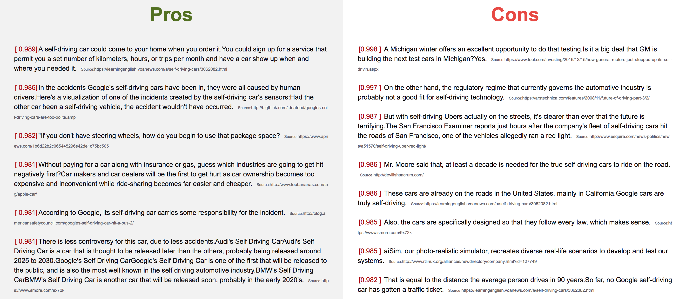
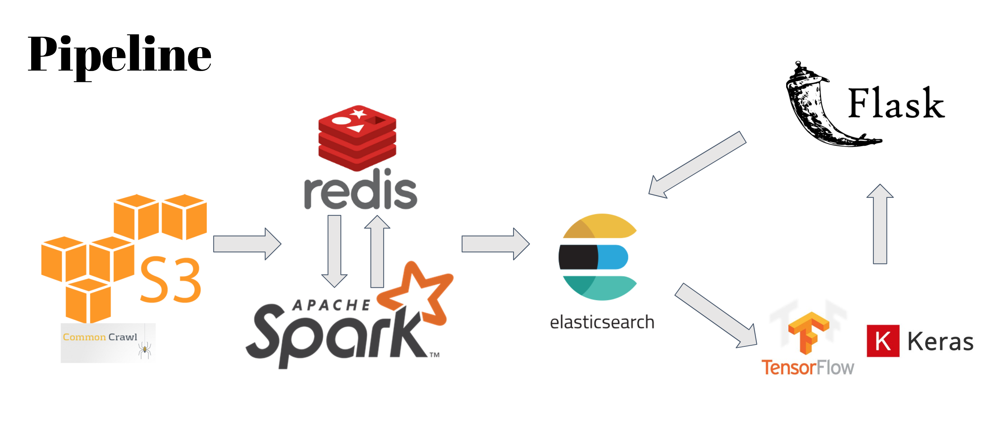
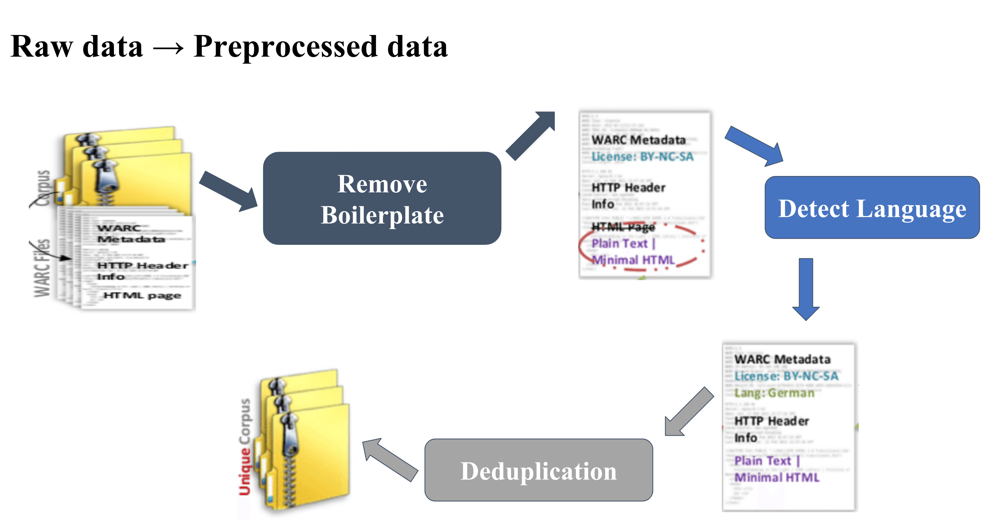
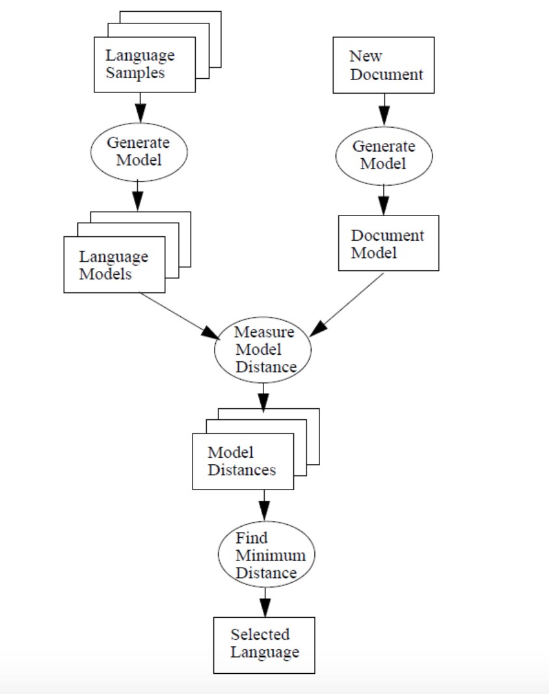
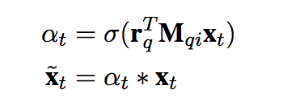
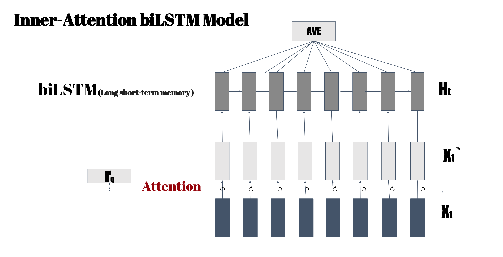

# Argument Spider

## What is it?
Argument Spider is a web search engine to retrieve individual argumentative sentences from web data for 
controversial topics.

>[Argument Spider is running here](http://ec2-52-13-61-56.us-west-2.compute.amazonaws.com:5000/)  
>[Video for searching "self driving"](https://www.youtube.com/watch?v=wzz3-XftccY&feature=youtu.be)  
>[Google Slides for introduction of Argument Spider](https://docs.google.com/presentation/d/165WDYcDfVdoiy8gR36nTCXvPcLT7KKlicLLaZxge7R0/edit#slide=id.g566ab6e222_0_81)
## Screenshoot
The results of searching "self driving" are below:


The resluts could be divided into two parts: left part is the list of pro arguments and right is the 
con arguments which are all extracted from the web page.besides, every argument comes with a URL to the original web page.
more details could be found in the [Video](https://www.youtube.com/watch?v=wzz3-XftccY&feature=youtu.be)
## Table of Contents

## Introduction
Argumentation is a domain of knowledge that studies debate and reasoning processes.The typical argument structure \
is composed by  two parts:  
  * Topic: a short, usually controversial statement
  * Argument: a span of text expressing evidence or reasoning that can be used to either support or oppose a \
given topic.  

A topic would be part of a (major) claim expressing a positive or negative stance, and our arguments would be premises with supporting/
 attacking consequence relations to the claim.
 In this peoject, topics are restricted  to be expressed through keywords, and arguments that consist of individual sentences.
 
 Besides,deep learning are rapidly evolving recently and show a  huge  potential for automated reasoning. therefor,this project 
 implenment a deep learning model to identify individual argumentative sentences  and 
 classify them as "pros" or "con" for controversial topics.

 
## How does it work?


This system’s architecture
could be  split into two parts:offine and online processing parts.   
* The offine processing consists of collecting data from common crawl which stored
in S3,batched cleaning the raw data to plain-text with spark and redis,and  document-
indexed into Elasticsearch.  
* the online processing depend on users' query which could be a sentence or phrase of a topic.
elasticsearch will pull out the top-N relevant web pages  based on the query, Then the pre-trained  deep learning
 models which implement in Keras/tensorFlow identify the argumentative sentence and 
 determined if the  are support or oppose that queried topic.
### 1. Cleaned data
Raw data  from CommonCrawl project, which is the Web ARChive (WARC) format.[Common Crawl format example](https://gist.github.com/Smerity/e750f0ef0ab9aa366558#file-bbc-warc)
could be found here. It contains raw web html page data , extracted metadata and text extractions.Therefor the data-cleaning process consists of three steps:
 
 * ##### 1.1 boilerplate removal 
  The boilerplate code or boilerplate refers to sections of code that should be reused over and over with little or no alteration.
  By extension, the idea is sometimes applied to reusable programming, as in “boilerplate code.” it is worth to 
    clean up a web page by removing the uninformative content such as navigation 
    bars, advertisements, header, footer, etc.  
  To achieve it,an [Justext algorithm](https://is.muni.cz/th/45523/fi_d/phdthesis.pdf) which is  simple way of segmentation 
  utilized. Because the contents of some HTML tags are (by default) visually formatted as blocks by Web browsers,the idea is 
  to form textual blocks by splitting the HTML page on block-level tags like: BLOCKQUOTE, COL, COLGROUP, DD, DIV, FORM, H1, H2, H3, H4, H5, H6, LEGEND, LI, OPTGROUP, OPTION, P,
  , TABLE, TD, TEXTAREA, TH, THEAD, TR, UL. homogeneousness in most blocks enable  classify the textual blocks in a 
  given HTML page in one of the four classes:
  
   >  * bad, which considers boilerplate blocks
   >  * good, which is the main content blocks
   >  * short, which is a too short content block, thus a reliable decision cannot be made  
   >  * near-good, which is a content block that lies between a short and a good one.
   
 Then classification criteria make use of a set of textual 
 features extracted from the HTML page such as the link density, text density, and others.
 After removing the boilerplates, the html web page could be 
 plain text (by default) or  a minimal HTML.
 
 
 * ##### 1.2 language identification
 Common crawl is the largest multilingual web crawl available to date so that the raw data 
 have more than 
 40 languages.To deal with it,The process of language identification can be represented as below:
 
 
 The first stage generates the language models whose features could be represented as specific characteristics of language. 
 These features are words or N-grams with their occurrences in the training set. 
 Then when a new document come up,a document model creates by the similar way and go though the classification stage
 to determine the language.
 
 * ##### 1.3 near-duplicate content removal
Near-duplicates is a technical jargon which means several documents are almost, but not quite identical. For Example,
When you searching for the words “bus plunges”,you find 437 articles published with one day.To guarantee the quality of searching,the near-duplicates should 
be removed and keep the unique one.Google Came up with an algorithm [Detecting Near-Duplicates for Web Crawling](http://www.wwwconference.org/www2007/papers/paper215.pdf)
 in 2007 to tackle this problem for web pages incredibly fast.
 
 First,[Charikar's fingerprinting technique, ](https://www.cs.princeton.edu/courses/archive/spr04/cos598B/bib/CharikarEstim.pdf) 
 used to:   
 
   > * characterizing each document with a unique 64-bit vector, like a fingerprint.
   > * Apply hash functions to the characteristics which has a property that simhash possesses two conflicting properties: (A) The fingerprint of a document is a “hash” of its features, 
  and (B) Similar documents have similar hash values. 
   > * Obtain fingerprint
   > * Apply vector comparison function: Hamming-distance (fingerprint (doc1), fingerprint (doc2)) = k
   
 Characterizing Document is what things makes a document different from the others, such as 
 number of words, number of paragraphs, punctuation, sentences. But what is the most appropriate feature to generate the fingerprint?
 One way to characterize is using a technique known as shingling which consist to split documents in Shingles, 
 set of words grouped in n and n, also called n-gram grouping.  
 
 But how to make use of vector comparison function? When a new document come up, 
 .is it necessary to compare it with all the documents which has been checked? if we have 2^34 pages,then the time to compare with every one will be
  ```
  2^34=92 Billion
  ```
  Practically, When the documents hashed to 24-fingerprint,
 the hamming distance of near-duplicates usually less than 4. By virtue of Pigeonhole principle, if two documents are near-duplicates,when 
 24-bit fingerprints split into four blocks,
 at least one of blocks must be identical.Put it another way, If none of four blocks of a  document is identical with  each of four blocks 
 of  another document,we are sure those two documents could't be near-duplicates. Thus,cutting off the 64-bit fingerprint into four blocks, 
 -every block is 16-bit,and putting every block into a hashmap as the key,the 64-bit fingerprint as the value.When  a new 
  document come up, rather than compare  all documents, it firstly maps the values from hashmap by the keys which are four blocks of 
  64-bit fingerprint,then our comparison range narrows down to the mapped documents.The comparison number would be:
  
  ```
   2^34/2^16*4=1048576
   One million
  ```          
    


#### 2.  Inverted indexed the documents 
When raw web pages be cleaned up to plain-text, next step is to index them to Elasticsearch. Elasticsearch uses a structure called an 
inverted index, which is designed to allow very fast full-text searches. 
An inverted index consists of a list of all the unique words that appear in any document, and for each word,it has a hash relationship to 
 a list of the documents in which it appears.For example, let’s say we have two documents, each with a content field containing the following:

  > * The quick brown fox jumped over the lazy dog
  > * Quick brown foxes leap over lazy dogs in summer 
    
To create an inverted index, content field of each document split into separate words 
(which  called terms, or tokens), create a sorted list of all the unique terms, and then list in which document each term appears. 
The result looks something like this:


When we search for "quick brown",the documents in which each term appears come out.But within those documents,some are better match —more relevant to our query—than 
the others.Usually,to rank the relevance of those documents, [TF-IDF(term frequency–inverse document frequency)](http://www.tfidf.com/) 
Algorithm is default ranking function in which the importance increases proportionally to the number of times a word appears in the document but is offset by the frequency of the word
  in the corpus.
  
   But in language statistics, estimating probabilities using 
   frequency can be inaccurate. Hence, smoothing is typically used.In this project, BM25 used to smooth the analyzer of elasticserch. 
#### 3.  Trained models
Recent years, attention-based models have shown great success 
in many NLP tasks such as machine translation, question answering,and recognizing textual entailments.
Based on recurrent neural networks (RNN), 
external attention information was added to hidden representations to get an attentive sentence representation.  
However, in the RNN architecture, a word is added at each time step and the hidden 
state is updated recurrently, causing hidden states near the end of the sentence are expected to 
capture more information, near the end of the sentence be more attended due to their 
comparatively abundant semantic accumulation and finally  biased attentive weight towards 
the later coming words in RNN.

Different from typical attention based RNN models in which attention 
information is added after RNN computation, The inner-attention modal add the attention before computing 
the sentence representation. The words representation are weights according to question attention as follows:

    
  where Mqi is an attention matrix to transform a question representaion into the word embedding space.
  Then the dot value used to determine the question attention strength, which is a sigmoid function to normalize 
  the weight t between 0 and 1.The above attention process could be thought as sentence 
  distillation where the input words are distilled (or filtered) by question attention.
   Finally,the whole sentence based on this distilled input can be presented using traditional RNN model Like LSTM,
   biLSTM and GRU.
  
  
  The model is show below:
 



## Data source 

All the data are from [Common Crawl](http://commoncrawl.org/),which is the largest multilingual web crawl available to date
and contains petabytes of data and lives on Amazon S3. 
It is archived as the Web ARChive (WARC) format which  is the raw data from the crawl, 
providing a direct mapping to the crawl process that Not only does the format store the HTTP response 
from the websites it contacts (WARC-Type: response), it also stores information about how that
 information was requested (WARC-Type: request) and metadata on the crawl process itself (WARC-Type: metadata).
Typical warc Format file looks like:

This project utilized a small portion of the data from [2018 March](http://commoncrawl.org/2018/03/march-2018-crawl-archive-now-available/)  which approximates 20T.

